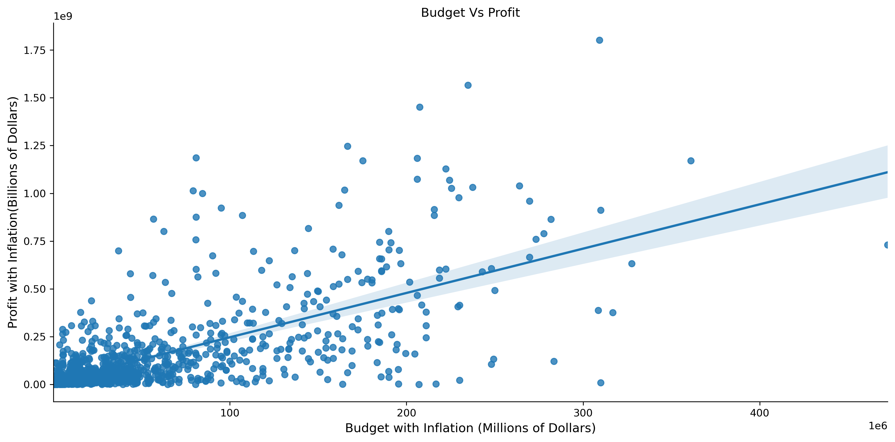
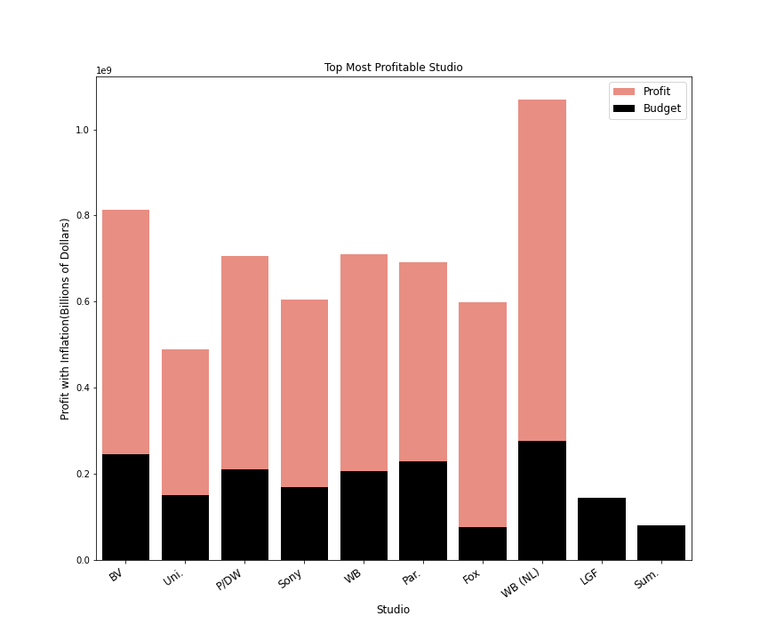

#  Microsoft New Movie Studio

**Author**: Monique Hercules 

## Overview

An analysis of the movie industry to gain insight on what it takes to not just make a movie, but a movie that stands the weight of time. From the insights gathered we will be able to create a template to create a successful new movie studio.

The new studio can use this information to predict the best production budget, genre and studio best practices needed make a successful movie studio.

That datasets used will be from notable movie databases like IMBD and The Numbers along with a few others.

## Business Problem

The creation of a new movie studio is a daunting task but with the data analysis from notable movie databases we will be able to gain some insights that answer a few questions.

First question, What's the most profitable movies with inflation accounted for in comparison to production budget? We can determine the first few movies we need to make to be profitable immediately, while building rapport in the movie studio industry.

Second question, what studios produced the most profit? By figuring out the studios that produced the most profit we will be able to gleam best practices that can be modeled in production and film development.

Third question, what genres on average produce the highest profit? This will give a direction to focus initial efforts upon, it will be best to start off producing movies in genres people already are fond of while avoiding high stake genres topics.


## Data

IMBD and The Numbers (a data movie business website) is where the datasets is from. We will be able to use this data to discern the attributes a new movie studio would need based on the various target variables, like production cost and genres, and profitability.

These data files feature genre, title, various budgets and a wide variety of review types.

## Methods

***Data Preparation:

Standardized column names,merged datasets and dropped unnecessary columns to make them easier to work with.

Cleaned through the various data by removing Nan variables (when applicable), commas and the symbols and while also converting data types.This made merging datasets possible.

Combining datasets aided the creation of a few variables from profit_margin to profit_inflation to name a few.

Inflation was taken in consideration to make the production cost and profit applicable to the current market.


## Results

**Question 1

What's the most profitable movies with inflation accounted for in comparison to production budget?

The most profitable movies are Avengers: Infinity War, Jurassic World and Furious 7.

Accounting for inflation in profit margin will provide a more accurate view of how well a movie aged in terms of profitability to scale in the market today. Most movies use less than 100 million dollars to produce there movies and make less than 500 million dollars in profit.

While movies that use a budget over 100 million to produce there movies have a higher chance of earning more than 500 million in profit.

Of the most_profitable_movies, there is a median profit margin of 60%. The budget used on these movies had a median of $3.3 million. Avoided using the mean because did not want to be effected by the outliers.


**Question 2 

What studios produced the most profit? 

Warner Brothers New Line Cinema, Disney Buena Vista, and Dreamworks taking the lead as the most profitable movie studio taking in account inflation and production costs.

**Question 3 

What genres on average produce the highest profit?

On average animaition, western, and sci-fi produce the highest profit of all the genres with a predictable margin of error.The genres with the highest margin of error is musicals and sports while the genre drama has the lowest margin of error making it a conservative safe choice to produce as a movie. 

Here is an example of how to embed images from your sub-folder:

### Visual 1






## Conclusions

After doing the analysis, the three recommendations for the creation of a new movie studio:

* **Aim for a movie budget around 300 million to be on average with making a profit margin over 60%.**

* **Base best practices for the creation of the studio on the most profitable studios of  Warner Bros New line Cinema, Dreamworks, and Disney Buena Vista.** Especially Fox, they were able to use less than 200 million to produce profit over 800 million. Allowing them to compete with Paramount, Warner Bros and Sony who used almost twice the budget for similar results. 

* **Animation, Western, and Sci-Fi are the most profitable genres with similar margin of error. Making each of these movie genre the most desirable genres to invest into.** 
Musicals and Sports have the highest margin of error, which make it a tough movie genre to have a predictable profit range.While drama has the lowest error of margin and average profit with inflation of almost 100 million.Making it a conservative movie genre for a new studio to make.

**Next Steps 

Attributes to consider for further analysis: 

* **The most profitable movies are Avengers: Infinity War, Jurassic World and Furious 7**. Considering that all of these movies are part of a  larger movie universe that have been produced over a set amount of time with a dedicated fan base. We can be left to assume that a lot of the profit margin is from an already dedicated fan base. By starting off with a movie that has a universe where we can create a dedicated fan base that spans an entire universe large enough to grow a large diverse character set.

* **Based on these studios we will be able to gleam best practices, but we must be aware that studios do have certain talents that are exclusive to them.** These will skew the data for profitable studios, because the movies produced could have only been profitable due to the use of a classic fan favorite actor/actress. This would be a further analysis needed to base the success of a movie due to the main lead. 

* **Keep in mind the some movies have multiple genres while others only have one so that data will be skewed.** Further study would be needed to discern deeper insights based of movies with only one genre versus movies with several.  

## For More Information

Please review my full analysis in [my Jupyter Notebook](./dsc-phase1-project.ipynb) or my [presentation](./DS_Project_Presentation.pdf).

For any additional questions, please contact **name & email, name & email**

## Repository Structure

Describe the structure of your repository and its contents, for example:

```
├── images                              <- Both sourced externally and generated from code
├── git ignore                         <- The git ignore Irrelevant for reviewers of this project
├── data                                <- Both sourced externally and generated from code
├── dsc-phase1-project.ipynb   <- Narrative documentation of analysis in Jupyter notebook
├── README.md                           <- The top-level README for reviewers of this project
└── DS_Project_Presentation.pdf         <- PDF version of project presentation

```
